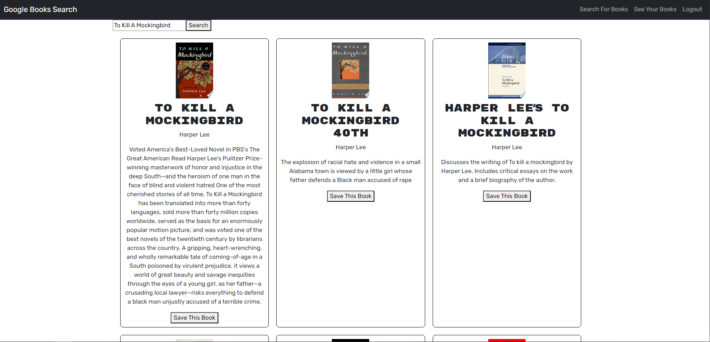

# Book-Search-Engine

## Description

This project was completed for the Columbia Coding Bootcamp. The purpose of this project was to alter existing code to use Apollo and GraphQL, replacing the existing RESTful API. The application is a book search engine that allows users to sign up, search books, and save books to their profiles.

## Installation

N/A

## Usage

This project is being deployed on Render at the following URL: [https://book-search-engine-b891.onrender.com](https://book-search-engine-b891.onrender.com). 

## Credits

I referenced previous projects and examples from the Columbia University Coding Bootcamp to assist in creating this page. 

## Features

Users can create an account using the signup feature on the navbar. Users can also search for books and see a picture of the book cover, the title, a description, and the author. Users can save these books to their profile and see it on the "See Your Books" tab, where they can also remove any books they want to.

## Screenshot of Deployed Application

